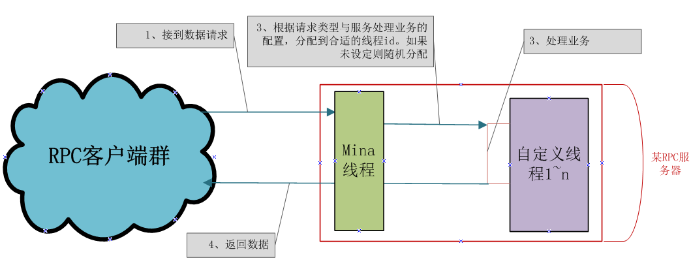
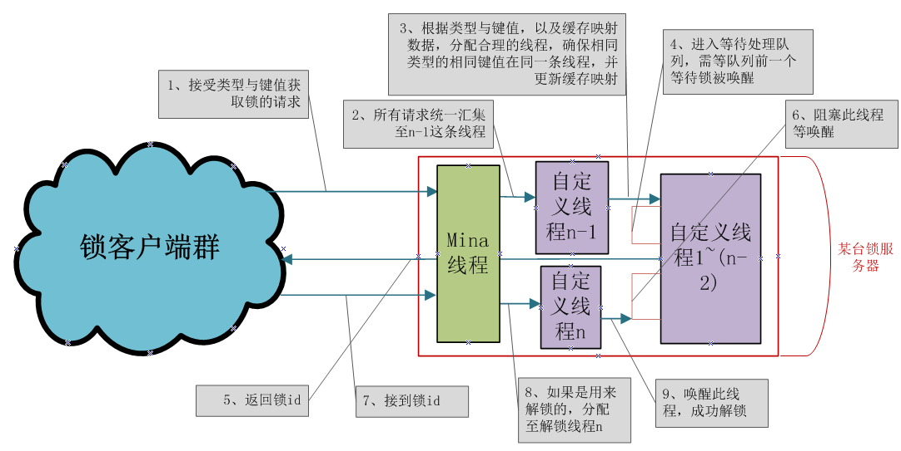

# grain

[](https://travis-ci.org/dianbaer/grain)
[](https://www.codacy.com/app/232365732/grain?utm_source=github.com&amp;utm_medium=referral&amp;utm_content=dianbaer/grain&amp;utm_campaign=Badge_Grade)
[](LICENSE)

## grain是一个极简的、组件式的RPC框架，可与任何框架整合，灵活渐进且适合学习。同时包含``系统通用多线程模型与消息通讯``、``多对多关系的分布式锁``、``基于Servlet的HTTP框架``、``基于系统通用多线程模型的Websocket``、``支持行级锁的多线程锁``等组件，按需选择组件，不绑架开发者。

## grain架构图及其依赖关系（深颜色的是核心组件强烈推荐）


### 注意：``如果一台服务器已经承担了分布式锁服务器的角色，就不要用该服务器承担别的角色，因为这台服务器的大多数线程都会时而进行线程阻塞，等待锁客户端释放锁。``

## 开发者可根据项目情况按需选择组件：


## 核心组件介绍

---

### 1、grain-thread（系统通用多线程模型）

**介绍**：完美抽象了客观事物，包含：1、活跃于线程之间的活物，``进入动作``、``离开动作``、``轮训动作``（例如：人可以在线程间切换），2、处理完即销毁的非活物（例如：各类消息包处理后即可销毁）。

**使用场景**：grain-rpc、grain-distributedlock、grain-threadwebsocket，都是基于此系统通用多线程模型。任何需要多线程的业务都可以使用：例如MMORPG、即时通讯等。

**示例代码**：

1、启动示例，创建10条线程，每条线程3个优先级，每次轮训间隔100毫秒，通过ILog实现类的对象打印日志，锁定线程0条。
```
AsyncThreadManager.init(100, 10, 3, 0, ILog实现类的对象);
AsyncThreadManager.start();
```
2、将活物加入线程1、优先级1的进入队列（之后会触发``进入动作``、``轮训动作``）
```
AsyncThreadManager.addCycle(ICycle实现类的对象, 1, 1);
```
3、将活物加入线程1、优先级1的离开队列（之后会触发``离开动作``）
```
AsyncThreadManager.removeCycle(ICycle实现类的对象, 1, 1);
```
4、将非活物加入线程1、优先级1的处理队列（处理完即销毁）
```
AsyncThreadManager.addHandle(IHandle实现类的对象, 1, 1);
```

### 2、grain-threadmsg（系统通用多线程模型与消息通讯）。

**介绍**：支持``与系统通用多线程模型``、``系统多线程模型之间``进行消息通讯。

**使用场景**：需要系统通用多线程模型的场景，一般都需要进行消息通讯。所以可以一直跟grain-thread绑定使用。

**示例代码**：

1、初始化，通过ILog实现类的对象打印日志
```
MsgManager.init(true, Ilog日志);
```
2、设置``createuser``消息在的线程1、优先级1进行处理（如果不设置，则随机线程随机优先级处理）
```
ThreadMsgManager.addMapping("createuser", new int[] { 1, 1 });
```
3、注册关注某消息及对应处理方法（第2步设置消息归属哪个线程，对应处理方法就在哪个线程回调）
```
MsgManager.addMsgListener(IMsgListener实现类对象);
```
4、派发``createuser``消息，携带数据111与额外数据222（第3步所有关注此消息的方法，进行回调）
```
ThreadMsgManager.dispatchThreadMsg("createuser", 111, 222);
```

### 3、grain-rpc（RPC框架，含：RPC客户端与RPC服务器）。

### 4、grain-distributedlock（多对多关系的分布式锁，含：锁客户端与锁服务器）。

### 5、grain-threadwebsocket（基于系统通用多线程模型处理业务的websocket服务器）。

### 6、grain-httpserver（基于servlet的http框架）。

### 7、grain-threadkeylock（支持锁类型单键值与双键值的多线程锁）。

---

## 核心组件介绍


## 1、grain-thread（系统多线程模型）


	grain最核心的组件，支撑起上层很多组件包含threadmsg（线程消息通讯）、
	rpc（远程对象访问）、distributedlock（多对多关系的分布式锁）、threadwebsocket（websocket服务器）。
	
	grain-thread支持创建多线程池，业务轮询精准注入指定线程ID，任意消息（例如：msg、tcp、websocket等）精准注入指定线程ID。


[grain-thread-详细介绍](./grain-thread)

---


## 2、grain-threadmsg（系统多线程模型，线程消息通讯）


	系统多线程之间的通讯，业务线程跳转都依赖此组件。

	
[grain-threadmsg-详细介绍](./grain-threadmsg)

---


## 3、grain-rpc（远程对象访问）


	通过grain-rpc可以创建RPC客户端与服务器进行远程对象访问。多线程阻塞，唤醒等复杂的多线程业务都已内部解决。
	
	
RPC客户端


RPC服务器



	
	
>简单例子：
	
	
	1、创建消息包
	RPCTestC.Builder builder = RPCTestC.newBuilder();
	builder.setName("RPC你好啊");
	TcpPacket pt = new TcpPacket(TestTCode.TEST_RPC_C, builder.build());
	2、远程调用
	TcpPacket ptReturn = WaitLockManager.lock(session, pt);
	


>例子（包含RPC客户端与RPC服务器，直接运行main函数即可）：


[grain-rpc-clienttest](./grain-rpc-clienttest)

[grain-rpc-servertest](./grain-rpc-servertest)


[grain-rpc-详细介绍](./grain-rpc)

---


## 4、grain-distributedlock（多对多关系的分布式锁）


	去中心化思路，通过grain-distributedlock可以创建分布式锁服务器与锁客户端。
	grain-distributedlock不同类型互不影响，相同类型不同键值互不影响。仅仅当类型与键值都相等时会进行分布式阻塞。
	锁客户端与锁服务器的双向线程阻塞，服务器匹配、类型键值与线程ID的匹配都已内部解决。

锁客户端


锁服务器



	

>简单例子：

	// 获取锁
	int lockId = DistributedLockClient.getLock("111", "user");
	if (lockId == 0) {
		return;
	}
	/*********** 执行分布式锁业务逻辑 *********/
	System.out.println("分布式锁id为：" + lockId);
	/*********** 执行分布式锁业务逻辑 *********/
	// 释放锁
	DistributedLockClient.unLock("111", "user", lockId);
	
	
>例子（包含分布式锁客户端与服务器，直接运行main函数即可）：


[grain-distributedlock-clienttest](./grain-distributedlock-clienttest)


[grain-distributedlock-servertest](./grain-distributedlock-servertest)


[grain-distributedlock-详细介绍](./grain-distributedlock)

---


## 5、grain-threadwebsocket（websocket服务器创建）


	将grain-threadwebsocket包引入web工程，可以创建websocket服务器。
	（业务分发至系统多线程模型grain-thread，可以精准指派某业务归属线程ID）
	
	public class TestWSService implements IWSListener {
		@Override
		public Map<String, String> getWSs() throws Exception {
			HashMap<String, String> map = new HashMap<>();
			map.put("testc", "onTestC");
			return map;
		}
		public void onTestC(WsPacket wsPacket) throws IOException, EncodeException {
			TestC testc = (TestC) wsPacket.getData();
			wsPacket.putMonitor("接到客户端发来的消息：" + testc.getMsg());
			TestS.Builder tests = TestS.newBuilder();
			tests.setWsOpCode("tests");
			tests.setMsg("你好客户端，我是服务器");
			WsPacket pt = new WsPacket("tests", tests.build());
			Session session = (Session) wsPacket.session;
			session.getBasicRemote().sendObject(pt);
		}
	}


>例子（该例子内部含有js websocket客户端，使用tomcat启动即可）：


[grain-threadwebsocket-test](./grain-threadwebsocket-test)

[grain-threadwebsocket-详细介绍](./grain-threadwebsocket)

---


## 6、grain-httpserver（创建http服务器）

	定义关键字并统筹所有请求参数，进行数据格式化。支持文件与操作数据的隔离。
	支持post表单数据与json数据，支持表单文件，支持get拼接参数，支持扩展消息包过滤器，支持扩展请求回复类型。

	public class TestHttpService implements IHttpListener {
		@Override
		public Map<String, String> getHttps() {
			HashMap<String, String> map = new HashMap<>();
			map.put("1", "onTestC");//返回json
			map.put("2", "onFileC");//返回文件
			map.put("3", "onImageC");//返回图片
			map.put("4", "onStringC");//返回字符串
			map.put("5", "onReplyStringC");//返回自定义头消息字符串
			map.put("6", "onException");//异常返回
			return map;
		}
		public HttpPacket onTestC(HttpPacket httpPacket) throws IOException, EncodeException {
			GetTokenS.Builder builder = GetTokenS.newBuilder();
			builder.setHOpCode(httpPacket.gethOpCode());
			builder.setTokenId("111111");
			builder.setTokenExpireTime("222222");
			HttpPacket packet = new HttpPacket(httpPacket.gethOpCode(), builder.build());
			return packet;
		}
		public ReplyFile onFileC(HttpPacket httpPacket) throws IOException, EncodeException {
			File file = new File(HttpConfig.PROJECT_PATH + "/" + HttpConfig.PROJECT_NAME + "/k_nearest_neighbors.png");
			ReplyFile replyFile = new ReplyFile(file, "你好.png");
			return replyFile;
		}
		public ReplyImage onImageC(HttpPacket httpPacket) throws IOException, EncodeException {
			File file = new File(HttpConfig.PROJECT_PATH + "/" + HttpConfig.PROJECT_NAME + "/k_nearest_neighbors.png");
			ReplyImage image = new ReplyImage(file);
			return image;
		}
		public String onStringC(HttpPacket httpPacket) throws IOException, EncodeException {
			return "<html><head></head><body><h1>xxxxxxxxxxxx<h1></body></html>";
		}
		public ReplyString onReplyStringC(HttpPacket httpPacket) throws IOException, EncodeException {
			String str = "<html><head></head><body><h1>xxxxxxxxxxxx<h1></body></html>";
			ReplyString replyString = new ReplyString(str, "text/html");
			return replyString;
		}
		public void onException(HttpPacket httpPacket) throws HttpException {
			GetTokenS.Builder builder = GetTokenS.newBuilder();
			builder.setHOpCode("0");
			builder.setTokenId("111111");
			builder.setTokenExpireTime("222222");
			throw new HttpException("0", builder.build());
		}
	}

例子（该例子内部含有js http客户端，使用tomcat启动即可）：


[grain-httpserver-test](./grain-httpserver-test)


[grain-httpserver-详细介绍](./grain-httpserver)


---


## 7、grain-threadkeylock（支持锁类型单键值与双键值的多线程锁）


	在多线程业务中，支持锁类型的单键值与双键值，并且支持锁函数
	
	
简单例子1（锁函数）：当类型为TEST1，键值为111同时调用函数时，会进行锁定。
	
	
	public String lockFunction(Object... params) {}
	String str = (String) KeyLockManager.lockMethod("111", TEST1, (params) -> lockFunction(params), new Object[] { "222", 111 });
	
简单例子2（锁函数）：当类型为TEST1，键值为111或222同时调用函数时，会进行锁定。

	
	String str = (String) KeyLockManager.lockMethod("111", "222", TEST1, (params) -> lockFunction(params), new Object[] { "222", 111 });
	

[grain-threadkeylock-详细介绍](./grain-threadkeylock)


---


## 其他组件介绍


[grain-log-详细介绍](./grain-log)

[grain-msg-详细介绍](./grain-msg)
	
[grain-tcp-详细介绍](./grain-tcp)

[grain-config-详细介绍](./grain-config)

[grain-reds-详细介绍](./grain-redis)

[grain-mongodb-详细介绍](./grain-mongodb)

[grain-mariadb-详细介绍](./grain-mariadb)	
	
[grain-websocket-详细介绍](./grain-websocket)

[grain-httpclient-详细介绍](./grain-httpclient)


## 打版本

	ant
	
## 依赖

	java8
	
## 基于grain开发的项目

anyupload是一个极度纯净的上传插件，通过简单调整就可以融入到任何项目，支持多文件上传、上传速率动态控制、真实进度监控kb/s、分块生成MD5、分块上传、MD5校验秒传、暂停、取消等。

https://github.com/dianbaer/anyupload

https://gitee.com/dianbaer/anyupload

anychat是一个极简纯净的websocket聊天插件，支持对接任何身份系统，嵌入方只需提供三个API即可进行实时通讯。支持个人聊天、群聊天、上下线、查看聊天记录、离线消息推送等，服务器绝对控制权的推送机制，合理的线程设计，支持mongodb存储聊天记录，天生的嵌入式支持。 

https://github.com/dianbaer/anychat

https://gitee.com/dianbaer/anychat

startpoint是一个身份系统，提供用户、树形结构组、token等API。

https://github.com/dianbaer/startpoint

https://gitee.com/dianbaer/startpoint
	
## github地址：

https://github.com/dianbaer/grain

## 码云地址：

https://gitee.com/dianbaer/grain
	
