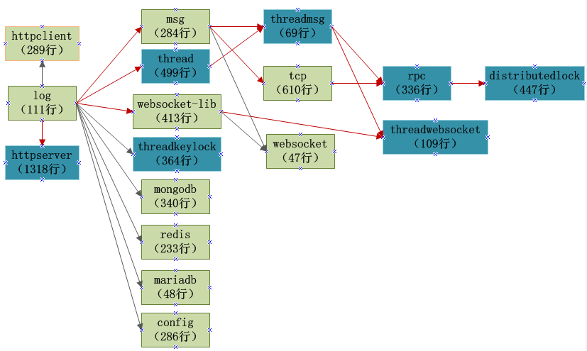
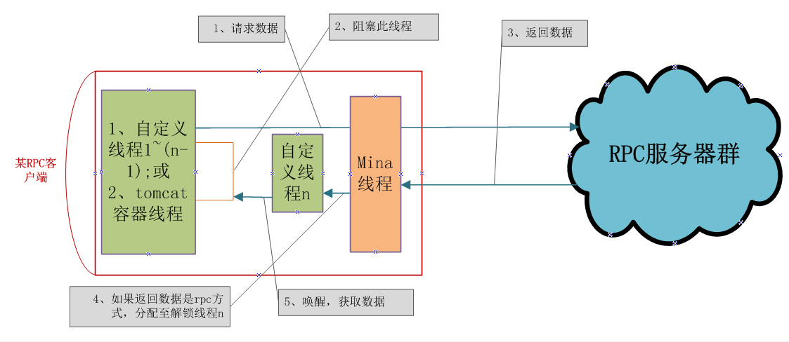
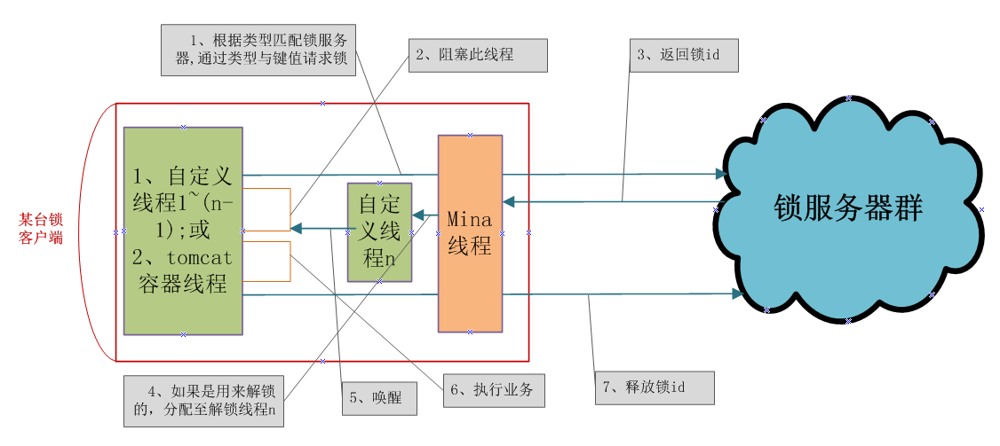

# grain

[](https://travis-ci.org/dianbaer/grain)
[](https://www.codacy.com/app/232365732/grain?utm_source=github.com&amp;utm_medium=referral&amp;utm_content=dianbaer/grain&amp;utm_campaign=Badge_Grade)
[](LICENSE)

## grain是一个极简的、组件式的RPC框架，灵活且适合渐进学习，可与任何框架整合。同时包含（系统通用多线程模型与消息通讯、多对多关系的分布式锁、基于Servlet的HTTP框架、基于系统通用多线程模型的Websocket框架、支持行级锁的多线程锁）等组件，按需选择组件，不绑架开发者。

## grain架构图及其依赖关系（深颜色的是核心组件强烈推荐）




## 核心组件介绍

-------------

### 1、grain-thread（系统通用多线程模型）

**介绍**：完美抽象了客观事物，包含：1、活跃于线程之间的活物，``进入动作``、``离开动作``、``轮训动作``（例如：人可以在线程间切换），2、处理完即销毁的非活物，``处理动作``（例如：各类消息包处理后即可销毁）。3、优秀的多线程轮训机制，队列机制（生产者与消费者），服务器掌握绝对的控制权。

**使用场景**：grain-rpc、grain-distributedlock、grain-threadwebsocket，都是基于此系统通用多线程模型。任何需要多线程的业务都可以使用：例如``MMORPG``、``即时通讯``等。

**示例代码**：

1、启动示例，创建10条线程，每条线程3个优先级，每次轮训间隔100毫秒，通过ILog实现类的对象打印日志，锁定线程0条。
```
AsyncThreadManager.init(100, 10, 3, 0, ILog实现类的对象);
AsyncThreadManager.start();
```
2、将活物加入线程1、优先级1的进入队列（之后会触发``进入动作``、之后不断触发``轮训动作``）
```
AsyncThreadManager.addCycle(ICycle实现类的对象, 1, 1);
```
3、将活物加入线程1、优先级1的离开队列（之后会触发``离开动作``）
```
AsyncThreadManager.removeCycle(ICycle实现类的对象, 1, 1);
```
4、将非活物加入线程1、优先级1的处理队列（之后会触发``处理动作``，处理完即销毁）
```
AsyncThreadManager.addHandle(IHandle实现类的对象, 1, 1);
```

-------------------------

### 2、grain-threadmsg（系统通用多线程模型与消息通讯）。

**介绍**：支持``与系统通用多线程模型``、``系统通用多线程模型之间``进行消息通讯。可以进行``消息配置``、``消息注册``、``消息分发``、``消息回调``。

**使用场景**：需要系统通用多线程模型的场景，一般都需要进行消息通讯。可以一直跟grain-thread绑定使用。

**示例代码**：

1、初始化，通过ILog实现类的对象打印日志
```
MsgManager.init(true, Ilog日志);
```
2、设置所有关注``createuser``消息的处理函数在线程1、优先级1进行处理（如果不设置，则随机线程随机优先级处理）
```
ThreadMsgManager.addMapping("createuser", new int[] { 1, 1 });
```
3、注册关注某消息及对应处理函数（第2步消息设置归属哪个线程，对应处理函数就在哪个线程回调）
```
MsgManager.addMsgListener(IMsgListener实现类对象);
```
4、派发``createuser``消息，携带数据111与额外数据222（第3步所有关注此消息的处理函数，进行回调）
```
ThreadMsgManager.dispatchThreadMsg("createuser", 111, 222);
```

--------------------

### 3、grain-rpc（支持多对多关系的RPC框架，含：RPC客户端与RPC服务器）。

**介绍**：基于Mina网络层及Protobuf序列化开发的RPC通讯框架，相比7层HTTP通讯，4层TCP通讯消息包更小、传输速度更快、队列化处理消息包、消息包与线程可一一映射配置化，支持多对多关系、断线重连等。




**使用场景**：生产环境内部网络的服务器之间进行消息通讯。

**示例代码**：

1、RPC客户端（启动类test.RPCClientTest.java，直接启动即可连接下面的RPC服务器）

[>>>>>>RPC客户端Demo](./grain-rpc-clienttest)

2、RPC服务器（启动类test.RPCServerTest.java，直接启动即可接受上面的RPC客户端连接请求）

[>>>>>>RPC服务器Demo](./grain-rpc-servertest)

3、RPC方式获取数据示例

```
//创建消息包
RPCTestC.Builder builder = RPCTestC.newBuilder();
builder.setName("RPC服务器你好啊");
TcpPacket pt = new TcpPacket("TEST_RPC_C", builder.build());
//RPC远程调用，返回结果
TcpPacket ptReturn = WaitLockManager.lock(session, pt);
```

--------------------

### 4、grain-distributedlock（支持多对多关系的分布式锁，含：分布式锁客户端与分布式锁服务器）。

**介绍**：去中心化，支持行级锁（锁某类型的单键值）。不同类型互不影响，相同类型不同键值互不影响。仅当类型与键值都相等时会进行分布式阻塞。

**注意**：如果一台服务器已经承担了分布式锁服务器的角色，就不要用该服务器承担别的角色，因为这台服务器的大多数线程都会不时进行线程阻塞，等待锁客户端释放锁。




**使用场景**：在无中心化的服务器集群中，有很大的意义。不用依赖数据库Mysql，即可保障服务器集群业务的原子性，又大幅度提高服务器集群性能，减少错误的数据库提交。

**示例代码**：

1、分布式锁客户端（启动类test.DistributedlockClientTest.java，直接启动即可连接下面的分布式锁服务器）

[>>>>>>分布式锁客户端Demo](./grain-distributedlock-clienttest)

2、分布式锁服务器（启动类test.DistributedlockServerTest.java，直接启动即可接受上面的分布式锁客户端连接请求）

[>>>>>>分布式锁服务器Demo](./grain-distributedlock-servertest)

3、分布式客户端获取锁，释放锁示例

```
// 获取类型为user，键值为111的锁
int lockId = DistributedLockClient.getLock("111", "user");
if (lockId == 0) {
	return;
}
/***********执行分布式锁业务逻辑开始*********/
/***********执行分布式锁业务逻辑结束*********/
// 释放类型为user，键值为111的锁
DistributedLockClient.unLock("111", "user", lockId);
```

---------------

### 5、grain-threadwebsocket（基于系统通用多线程模型的Websocket框架）。

**介绍**：websocket消息不在tomcat默认线程处理，分发至系统通用多线程模型进行队列化处理。更加可定制化，支持websocket消息与线程ID一一映射，服务器绝对的处理控制权。

**使用场景**：在网站需要进行长连接通讯时，可以使用此框架。

**示例代码**：

1、Websocket服务器（直接用tomcat8.5启动即可，直接访问地址``http://localhost:8080/grain-threadwebsocket-test/index.html``，即可与服务器建立websocket连接）

[>>>>>>Websocket服务器Demo](./grain-threadwebsocket-test)

2、处理业务示例
```
public void onTestC(WsPacket wsPacket) throws IOException, EncodeException {
	//客户端发来的数据
	TestC testc = (TestC) wsPacket.getData();
	//构建返回数据
	TestS.Builder tests = TestS.newBuilder();
	tests.setWsOpCode("tests");
	tests.setMsg("你好客户端，我是服务器");
	WsPacket pt = new WsPacket("tests", tests.build());
	//获取session
	Session session = (Session) wsPacket.session;
	//推送数据
	session.getBasicRemote().sendObject(pt);
}
```
3、anychat是一个极简纯净的websocket聊天插件，支持对接任何身份系统，嵌入方只需提供三个API即可进行实时通讯。支持个人聊天、群聊天、上下线、查看聊天记录、离线消息推送等，服务器绝对控制权的推送机制，合理的线程设计，支持mongodb存储聊天记录，天生的嵌入式支持。 


[>>>>>>anychat github地址](https://github.com/dianbaer/anychat)

[>>>>>>anychat 码云地址](https://gitee.com/dianbaer/anychat)


----------------

### 6、grain-httpserver（基于Servlet的HTTP框架）。

**介绍**：一个非常轻量级的基于Servlet的HTTP框架，只有1318行代码。小身材，五脏齐全，扩展性强。支持各种请求方式，支持文件与数据包分离，支持扩展请求过滤器，支持扩展请求回复类型。

**使用场景**：开发HTTP项目，不想使用Spring、struts2，可以选择此框架，真的轻量到不能再轻量了（除非你想直接用Servlet）。

**示例代码**：

1、HTTP服务器（直接用tomcat8.5启动即可，直接访问地址``http://localhost:8080/grain-httpserver-test/index.html``，发送纯数据请求、发送携带文件的表单请求）

[>>>>>>HTTP服务器Demo](./grain-httpserver-test)

2、6种返回类型示例（可扩展）

```
//返回json
public HttpPacket onTestC(HttpPacket httpPacket) throws HttpException {
	GetTokenS.Builder builder = GetTokenS.newBuilder();
	builder.setHOpCode(httpPacket.gethOpCode());
	builder.setTokenId("111111");
	builder.setTokenExpireTime("222222");
	HttpPacket packet = new HttpPacket(httpPacket.gethOpCode(), builder.build());
	return packet;
}
```
```
//返回文件
public ReplyFile onFileC(HttpPacket httpPacket) throws HttpException {
	File file = new File("k_nearest_neighbors.png");
	ReplyFile replyFile = new ReplyFile(file, "你好.png");
	return replyFile;
}
```
```
//返回图片
public ReplyImage onImageC(HttpPacket httpPacket) throws HttpException {
	File file = new File("k_nearest_neighbors.png");
	ReplyImage image = new ReplyImage(file);
	return image;
}
```
```
//返回字符串
public String onStringC(HttpPacket httpPacket) throws HttpException {
	return "<html><head></head><body><h1>xxxxxxxxxxxx<h1></body></html>";
}
```
```
//返回字符串（自定义头消息）
public ReplyString onReplyStringC(HttpPacket httpPacket) throws HttpException {
	String str = "<html><head></head><body><h1>xxxxxxxxxxxx<h1></body></html>";
	ReplyString replyString = new ReplyString(str, "text/html");
	return replyString;
}
```
```
//抛自定义错误，进行返回
public void onException(HttpPacket httpPacket) throws HttpException {
	GetTokenS.Builder builder = GetTokenS.newBuilder();
	builder.setHOpCode("0");
	builder.setTokenId("111111");
	builder.setTokenExpireTime("222222");
	throw new HttpException("0", builder.build());
}
```

3、anyupload是一个极度纯净的上传插件，通过简单调整就可以融入到任何项目，支持多文件上传、上传速率动态控制、真实进度监控kb/s、分块生成MD5、分块上传、MD5校验秒传、暂停、取消等。

[>>>>>>anyupload github地址](https://github.com/dianbaer/anyupload)

[>>>>>>anyupload github地址](https://gitee.com/dianbaer/anyupload)


4、startpoint是一个身份系统，提供用户、树形结构组、token等API。

[>>>>>>startpoint github地址](https://github.com/dianbaer/startpoint)

[>>>>>>startpoint github地址](https://gitee.com/dianbaer/startpoint)

----------------

### 7、grain-threadkeylock（支持行级锁的多线程锁）。

**介绍**：支持锁类型的单键值与双键值的多线程锁，精细化至行级锁，提高并发能力。

**注意**：``单服务器架构有价值，集群架构没任何意义，集群架构请使用分布式锁grain-distributedlock。``

**使用场景**：在单服务器架构时，可以在不依赖数据库的情况下，支持到行级锁。

**示例代码**：

1、初始化类型为``TEST1``、``TEST2``的多线程锁，锁等待最大时间为2分钟，每100毫秒醒来重试，通过ILog实现类的对象打印日志
```
KeyLockManager.init(new String[] { "TEST1", "TEST2" }, 120000, 100, ILog实现类的对象);
```
2、锁定``TEST1``类型，键值为222，同时调用lockFunction函数，传递两个参数str与111。（lockFunction没执行完成，同一时刻如果还是``TEST1``类型，键值``222``，会被阻塞）
```
//锁定函数
public String lockFunction(Object... params) {}
//加锁调用
String str = (String) KeyLockManager.lockMethod("222", "TEST1", 
(params) -> lockFunction(params), new Object[] { "str", 111 });
```
3、锁定``TEST1``类型，键值为222与111，同时调用lockFunction函数，传递两个参数str与111。（lockFunction没执行完成，同一时刻如果还是``TEST1``类型，键值``222``或``111``，会被阻塞）
```
//锁定函数
public String lockFunction(Object... params) {}
//加锁调用
String str = (String) KeyLockManager.lockMethod("111", "222", "TEST1", 
(params) -> lockFunction(params), new Object[] { "str", 111 });
```
-----------------


## 更多详细介绍

[>>>>>>grain-thread-详细介绍](./grain-thread)

[>>>>>>grain-threadmsg-详细介绍](./grain-threadmsg)

[>>>>>>grain-rpc-详细介绍](./grain-rpc)

[>>>>>>grain-distributedlock-详细介绍](./grain-distributedlock)

[>>>>>>grain-threadwebsocket-详细介绍](./grain-threadwebsocket)

[>>>>>>grain-httpserver-详细介绍](./grain-httpserver)

[>>>>>>grain-threadkeylock-详细介绍](./grain-threadkeylock)

[>>>>>>grain-log-详细介绍](./grain-log)（不建议单独使用）

[>>>>>>grain-msg-详细介绍](./grain-msg)（不建议单独使用，建议直接用grain-threadmsg）

[>>>>>>grain-tcp-详细介绍](./grain-tcp)（不建议单独使用，建议直接用grain-rpc）

[>>>>>>grain-config-详细介绍](./grain-config)

[>>>>>>grain-reds-详细介绍](./grain-redis)

[>>>>>>grain-mongodb-详细介绍](./grain-mongodb)

[>>>>>>grain-mariadb-详细介绍](./grain-mariadb)	

[>>>>>>grain-websocket-详细介绍](./grain-websocket)（不建议使用，建议使用grain-threadwebsocket）

[>>>>>>grain-httpclient-详细介绍](./grain-httpclient)


## 打版本

	ant
	
	
## 推荐环境：

	jdk-8u121
	
	apache-tomcat-8.5.12

	MariaDB-10.1.22

	CentOS-7-1611
	
	mongodb-3.4.3
	
	redis-2.8.19
	
## grain地址：

[>>>>>>github](https://github.com/dianbaer/grain)

[>>>>>>码云](https://gitee.com/dianbaer/grain)
	
